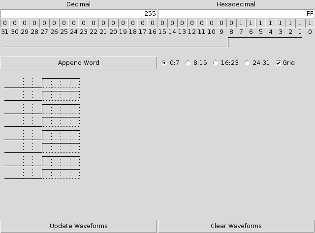

Bit Banger
==========

Bit Banger is a simple GUI written in [Tcl/Tk](http://www.tcl.tk/) to
aid the user in writing and/or deconding integer words needed to perform
[bit banging](https://en.wikipedia.org/wiki/Bit_banging) bus control on
various platforms.

## Requirements

[Tcl/Tk version 8.5 or later](http://www.tcl.tk/software/tcltk/).

## Usage

Simply write a number (either decimal or hexadecimal) in the appropriate
text entry and press the return key to toggle the state of the other
entry and the state of the 32 bits under the entries. Clicking on a bit
will toggle its state and change the content of the text entries
accordingly.

## Wishes

- <s>Add a canvas representing the waveforms generated by a group of words.</s>

## License

Copyright (C) 2016 Gianfranco Gallizia

Permission is hereby granted, free of charge, to any person
obtaining a copy of this software and associated documentation
files (the "Software"), to deal in the Software without
restriction, including without limitation the rights to use, copy,
modify, merge, publish, distribute, sublicense, and/or sell
copies of the Software, and to permit persons to whom the Software
is furnished to do so, subject to the following conditions:

The above copyright notice and this permission notice shall be
included in all copies or substantial portions of the Software.

THE SOFTWARE IS PROVIDED "AS IS", WITHOUT WARRANTY OF ANY KIND,
EXPRESS OR IMPLIED, INCLUDING BUT NOT LIMITED TO THE WARRANTIES
OF MERCHANTABILITY, FITNESS FOR A PARTICULAR PURPOSE AND
NONINFRINGEMENT. IN NO EVENT SHALL THE AUTHORS OR COPYRIGHT HOLDERS
BE LIABLE FOR ANY CLAIM, DAMAGES OR OTHER LIABILITY, WHETHER IN AN
ACTION OF CONTRACT, TORT OR OTHERWISE, ARISING FROM, OUT OF OR IN
CONNECTION WITH THE SOFTWARE OR THE USE OR OTHER DEALINGS IN THE
SOFTWARE.
